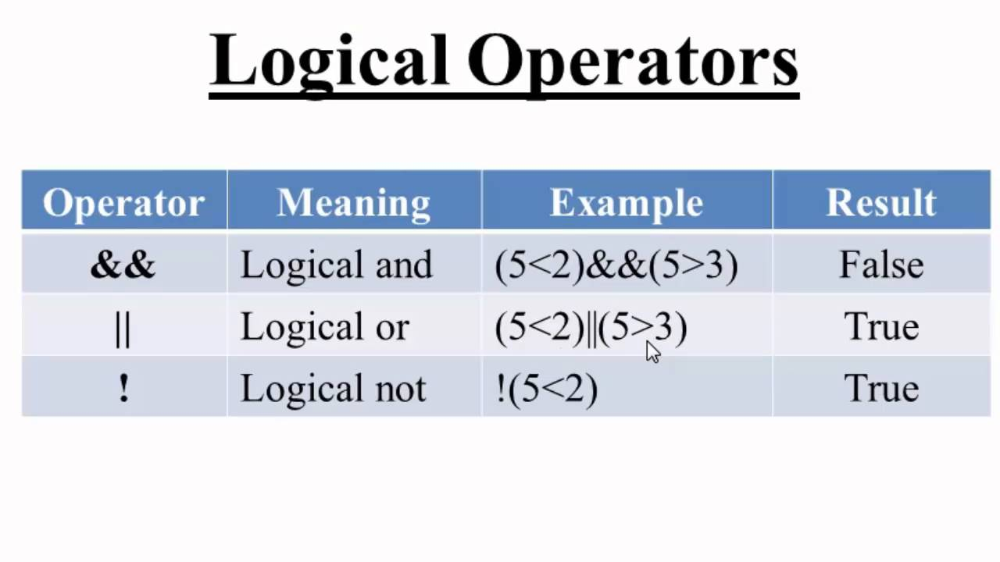

# Comparison and logical operators

## Comparison 
- JavaScript supports Many comparison operators.
- let's take example Assume variable A holds 10 and variable B holds 20 then we will take all operaters 

**Operater** | **Descriptions** |**Example**
------------ | -----------------|-----------------
== (Equal)| Checks if the value of two operands are equal or not, if yes, then the condition becomes true.|Ex: (A == B) is not true.
!= (Not Equal)| Checks if the value of two operands are equal or not, if the values are not equal, then the condition becomes true.|Ex: (A != B) is true.
_>_ (Greater than)| Checks if the value of the left operand is greater than the value of the right operand, if yes, then the condition becomes true.|Ex: (A > B) is not true..
_<_ (Less than)| Checks if the value of the left operand is less than the value of the right operand, if yes, then the condition becomes true.|Ex: (A < B) is true.
_>=_ (Greater than or Equal to)| Checks if the value of the left operand is greater than or equal to the value of the right operand, if yes, then the condition becomes true.|Ex: (A >= B) is not true.
_<=_ (Less than or Equal to)|Checks if the value of the left operand is less than or equal to the value of the right operand, if yes, then the condition becomes true.|Ex: (A <= B) is true.


# logical operators



- JavaScript supports have main three logical operators 
- let's take example Assume variable A holds 10 and variable B holds 20 then we will take all operaters 


**Operater** | **Descriptions** |**Example**
------------ | -----------------|-----------------
&& (Logical AND)|If both the operands are non-zero, then the condition becomes true.|Ex: (A && B) is true.
```|``````|```(Logical OR)|If any of the two operands are non-zero, then the condition becomes true.|Ex: (A || B) is true.
! (Logical NOT)|Reverses the logical state of its operand. If a condition is true, then the Logical NOT operator will make it false|Ex: ! (A && B) is false.
